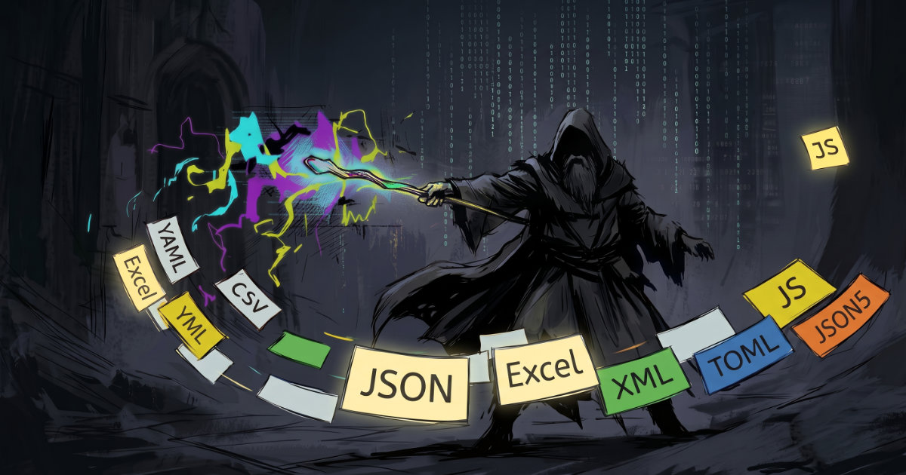

# Go SDK Overview

The Go SDK is the runtime library through which Go applications load and
access config data exported by Archmage.

[Archmage](https://shadop.dev/archmage/) is a configuration solution for
game development: specifications for how to structure config data, define
fields, and fill in each value; pipelines that export runtime data and
generate strongly typed code; multi-language SDKs for loading and accessing
that data at runtime; and a collaborative editing workflow for teams.

The SDK is built around the concept of an **Atlas** — a registry that maps named
keys to configurations. Each key is associated with one or more JSON files.
At runtime, the SDK reads these files, deserializes them into instances of
generated Go types, resolves cross-table references, and calls post-load hooks.

**Key features**

- **I18n** — multi-language text management with automatic fallback
- **XRef** — cross-table reference resolution via `Atlas.BindRefs`
- **MinMax** — random value selection within a range
- **WeightedPool** — weighted random selection with probability proportional to item weight
- **Variants** — switch an item to an alternative data set at load time via `WithVariant`
- **Whitelist/Blacklist** — load only a subset of items
- **Layered overrides** — merge files with matching relative paths from additional override sources (a directory path or an `fs.FS`) into the base configs, field by field, at load time
- **Pluggable load strategies** — parallel loading via `WithLoadStrategy`
- **Versioning** — VCS metadata (branch, commit, timestamp, etc.), when present in `atlas.json`, is available on the loaded atlas

## Requirements

- Go 1.27 or later

## Installation

```bash
go get shadop.dev/pkg/sdk-go
```

## Getting Started

```go
import "shadop.dev/pkg/sdk-go/archmage"

// ConfigAtlas is generated by Archmage
atlas := conf.NewConfigAtlas()
if err := archmage.LoadAtlas("configs/atlas.json", "configs/", atlas); err != nil {
    log.Fatal(err)
}
```

## Concepts

`atlas.json` is generated by Archmage. It declares how each config key maps to its JSON files using one of three strategies:

| Strategy | Shape | Behavior |
|---|---|---|
| unique | `key → "file.json"` | Deserializes one file into the config object |
| variant | `key → { "/": "file.json", "alt": "file-alt.json" }` | Selects one variant by case; `"/"` is the default |
| many | `key → ["a.json", "b.json"]` | Deserializes and merges multiple files in order |

Example `atlas.json`:

```json
{
    "unique": {
        "hero": "hero.json",
        "item": "clutter/item.json"
    },
    "variant": {
        "game": { "/": "game.json", "hard": "game_hard.json" }
    },
    "many": {
        "weapon": [ "vtbl/weapon-sword.json", "vtbl/weapon-staff.json" ]
    }
}
```

## Loading Configs

Loading proceeds in the following steps:

1. Parse `atlas.json`
2. Apply `AtlasModifier` (if set)
3. For each item: read files → deserialize → apply overrides
4. `BindRefs()` — resolve cross-table references
5. `OnLoaded()` — post-load initialization

## Options

Configure loading via functional options passed to `LoadAtlas`:

```go
err := archmage.LoadAtlas("configs/atlas.json", "configs/", atlas,
    // custom logger (default: slog.Default(); use &archmage.NullLogger{} to silence)
    archmage.WithLogger(myLogger),
    // load only these keys
    archmage.WithWhitelist([]string{"hero", "item"}),
    // skip these keys
    archmage.WithBlacklist([]string{"debug"}),
    // select a variant
    archmage.WithVariant("game", "hard"),
    // add an override directory
    archmage.WithOverrideRoot("configs/override/"),
    // add an override filesystem
    archmage.WithOverrideFS(embeddedFS),
    // mutate atlas.json after parsing
    archmage.WithAtlasModifier(func(aj *archmage.AtlasJSON) { ... }),
)
```

**Whitelist / Blacklist** — If a non-empty whitelist is set, only listed keys are loaded (blacklist
is ignored). All keys must exist in the atlas or an error is returned.

**Variant selection** — A variant-mapped key loads its `"/"` variant unless `WithVariant`
selects another one. The variant in use is recorded in `AtlasItem.Variant`.

**Override layers** — Each `WithOverrideRoot` / `WithOverrideFS` call adds another
override source. When loading an item, each override source is checked in the order they
were added; any matching file is deserialized and its fields applied on top of the base
data. This is useful for environment-specific patches.

Field-level merge rules during override processing:

| Value in override | Behavior |
|---|---|
| `null` | Resets the target field to its default value or raises an error |
| JSON object | Recursively merges — only fields present in the override are updated, others remain unchanged |
| Any other value | Overwrites the field |

**Custom load strategy** — By default, items are loaded one by one in alphabetical order.
`WithLoadStrategy` lets you take control of that loop — for example to load items in parallel:

```go
archmage.WithLoadStrategy(func(all iter.Seq2[string, *archmage.AtlasItem], load archmage.AtlasItemLoadFunc) error {
    eg, ctx := errgroup.WithContext(context.Background())
    eg.SetLimit(10)
    for k, item := range all {
        eg.Go(func() error { return load(ctx, k, item) })
    }
    return eg.Wait()
})
```

## Special Types

### I18n — Localization

`I18n` holds per-language translations and falls back to a default language when a key is missing.

```go
i18n := archmage.NewI18n(language.English)
_ = i18n.MergeL10nFile("l10n/en.json", language.English)
_ = i18n.MergeL10nFile("l10n/zh-CN.json", language.SimplifiedChinese)

i18n.Text("ui.ok", language.SimplifiedChinese)  // → "确认"
i18n.Text("ui.ok", language.Japanese)           // → falls back to "OK"
```

`Text` panics if the key is missing in both languages; use `GetText` to get an error instead.

In generated config types, localized fields are typed as `L10n`. In JSON they are
represented as strings (e.g., `"ui.ok"`); calling `.Text()` on an `L10n` field looks up
that key in a shared `I18n` instance. Set `GetI18n` and `GetPreferredLanguage` in the
generated package to configure the lookup before use.

```go
conf.GetI18n = func() *archmage.I18n { return i18n }
conf.GetPreferredLanguage = func() language.Tag { return language.SimplifiedChinese }

// Then in your code:
label := hero.Name.Text()
```

### XRef — Cross-table Reference

`XRef[V, T]` pairs a config ID (`CfgID`) with a resolved reference (`Ref`) set during `BindRefs`.

```go
// In generated config type:
Boss XRef[HeroCfgID, HeroCfg] `json:"boss"`

// After loading:
boss := atlas.HeroTable[1].Boss.Ref   // resolved *HeroCfg
```

### RGBA

A color type with `R`, `G`, `B`, `A` byte channels.

```go
color, _ := archmage.ParseRGBA("#FF8000")   // R=255, G=128, B=0, A=255
color.String()                              // "#FF8000"
```

### MinMax

`MinMax[T]` is a range bounded by `Min` and `Max`. The `Sample` method draws a random value from the range. `T` may be any integer type, `float32`, `float64`, or `Duration`.

### WeightedPool

`WeightedPool[T]` holds parallel `Items` and `Weights` slices. The `Sample` / `SampleIndex`
methods draw an item (or its index) at random with probability proportional to its
weight.

### Vec

`Vec2[T]`, `Vec3[T]`, `Vec4[T]` are typed vectors. Fields are accessed as `.X`, `.Y`, `.Z`, `.W`.

### Tuple

`Tuple1`–`Tuple7` are heterogeneous tuples. They serialize as JSON objects with keys
`item0`, `item1`, etc. (0-based). Fields are accessed as `.Item0`, `.Item1`, etc.,
and `Unpack` returns all values at once.

## Data Versioning

`atlas.json` can carry a `version` block with VCS metadata (branch, commit ID, timestamp, author). After loading, it is available on the atlas:

```json
{
    "version": {
        "branch": "main",
        "id": "a1b2c3d4e5f6...",
        "shortId": "a1b2c3d",
        "timestamp": "2025-01-01T00:00:00Z"
    },
    ...
}
```

```go
if ver := atlas.DataVersion; ver != nil {   // *archmage.VersionInfo, nil if not present
    ver.Branch    // "main"
    ver.ShortID   // "a1b2c3d"
}
```

## See Also

- **Documentation**: https://pkg.go.dev/shadop.dev/pkg/sdk-go/archmage
- **Source Code**: https://github.com/shadowopera/sdk-go

---

## Development

### Project Structure

```
sdk-go/
├── archmage/                       # Go runtime source (public API)
└── internal/                       # Tests
    ├── conf/                       # Generated config code
    ├── testdata/                   # atlas.json and config JSON
    ├── override/                   # Override-layer JSON
    └── golden/                     # Expected DumpAtlas output
```

### Build & Test

```bash
go test ./...
go test ./internal -run TestAtlasGolden
go test ./internal -run TestAtlasGolden -update   # regenerate golden files
go test ./internal -run TestPorting -porting      # compare Go vs C# golden files
```

## License

Apache 2.0. See [LICENSE](LICENSE) for details.
